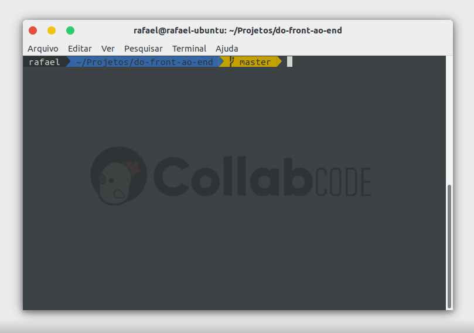
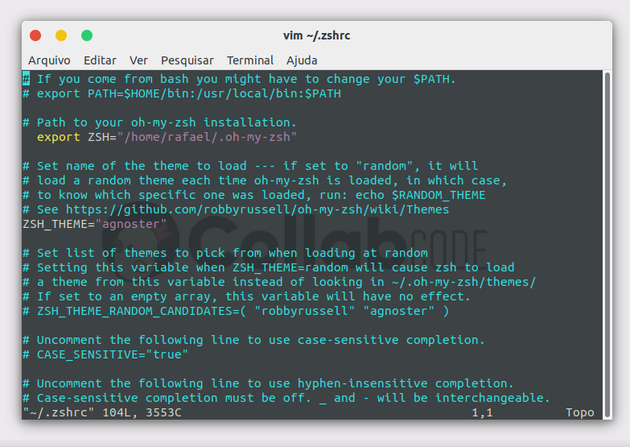

# 001 - Desafios [CollabCode] - Do Front Ao End

1. Configurar o terminal e alterar o tema




2. Markdown com outros comandos

**Exemplo de área de código**

```bash
cd Projetos
mkdir CollabCode
```
> *bash*

```css
div {
    font-size: 12px;
    width: 100%;
    height: 80%;
    padding: 20px 5px 10px 5px;
}
```
> *css*

3. Mudar a mensagem do último commit

Para alterar o commit antes do push, podemos utilizar o comando `git commit --amend`, o qual irá abrir o editor de texto com o conteúdo do último commit, possibilitando assim a sua alteração.